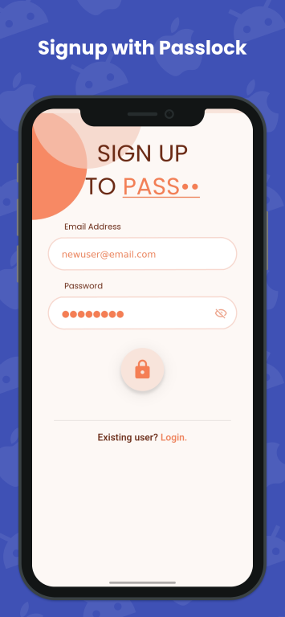
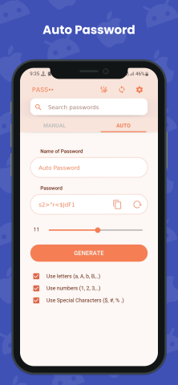
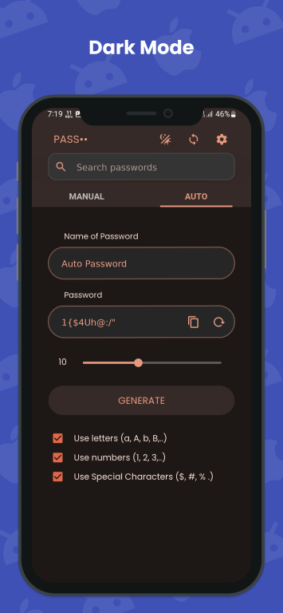
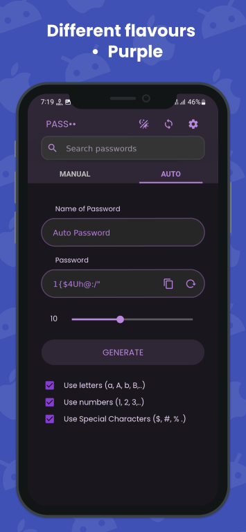
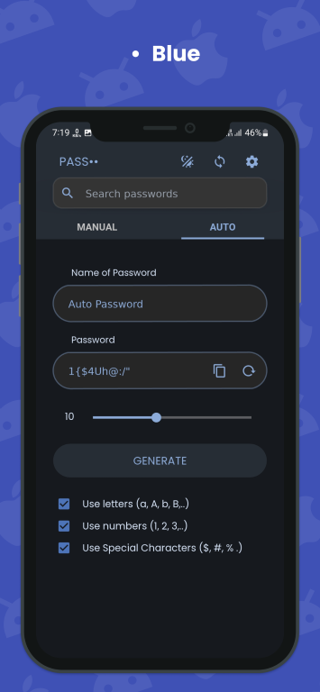

# Passlock

    

<h3 align="center">
    <a href="https://www.youtube.com/watch?v=EOkMDc5mZWI">
        See video demo
    </a>
</h3>

Password Manager for android.
<<<<<<< HEAD

=======

>>>>>>> ca9dfbb3f228440783cd9b19d40435b1c9f5fa42
    <a href="https://github.com/AM-ash-OR-AM-I/PasslockDesktop">
        Check Out Passlock for desktop.
    </a>

## Features
* Backup and sync passwords across devices.
* Encrypted passwords using AES 128bit for maximum security.
* Mimics Material v3 Monet engine, to use different color themes. (Self-made)
* Make strong passwords through built in password generator.
* Advanced finding algorithm to search for passwords easily.

## Releases

<a href = "https://github.com/AM-ash-OR-AM-I/PasslockDesktop/releases/download/0.2/Passlock.msi"><h3>
    Get  for Android
    </h3> 
</a>

## Screenshots

    
    
    

    
    
    

