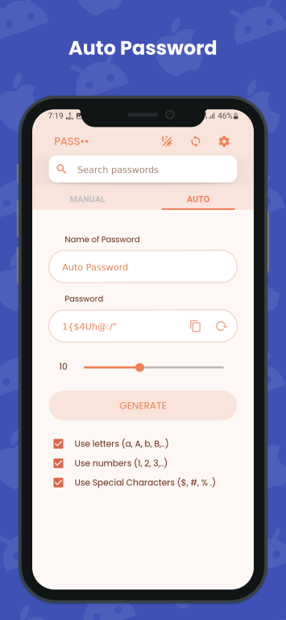

    

<h1 align="center">
    Passlock for android
</h1>

<h3 align="center">
    <a href="">
        See video demo
    </a>
</h3>

A Password Manager for android.

Also Check Out Passlock for desktop 💻 [here.](https://github.com/AM-ash-OR-AM-I/PasslockDesktop)

## Features ✨

* Backup and sync passwords across devices 💻📱.
* Encrypted passwords using AES 128bit for maximum security.
* Mimics Material v3 Monet engine with 🌙 Dark Mode, to use different 🎨 color themes. (Self-made)
* Make strong passwords 🔑 through built in password generator.
* Advanced 🔍 finding algorithm to search for passwords easily.

## Releases 📥️

#### Check latest apk links for [📱 Android here.](https://github.com/AM-ash-OR-AM-I/Passlock/releases)

## Build 📦️

* Get `WEB_API_KEY` from firebase project and add it to github secrets.
* Add `DATABASE_URL` to repository variables.
* Now you are all set build app 🎉, make some changes push it then tag a release 🚀
  * e.g. `git tag v0.0.1 && git push --tags`
  * Workflow will be triggered and will automatically create a release for apk.

## Screenshots 📱

 |  |  |
------------------------- | ------------------------- | ------------------------- |
 |  |  |
